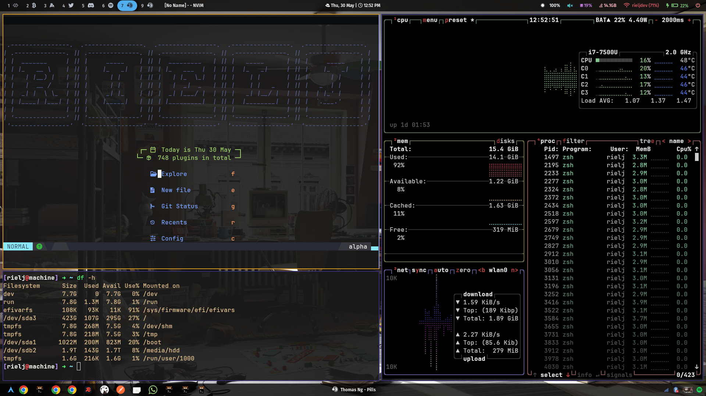
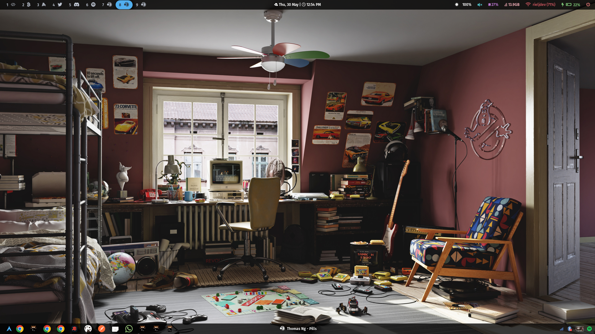

# Dotfiles Repository

Welcome to my dotfiles repository! This collection includes configurations for a variety of applications and tools, meticulously crafted to enhance your workflow and aesthetic experience. Below is a brief overview of the configurations included.

## 🌟 Features

- **Beautifully customized terminal and editors**
- **Efficient window management**
- **Polished notifications and bars**
- **Seamless integration with various applications**

## 📂 Directory and File Structure

### Active Configurations

- `kitty` - Kitty terminal emulator configuration
- `mako` - Mako notification daemon configuration
- `mimeapps` - Default applications configuration
- `nvim` - Neovim text editor configuration
- `nwg-launchers` - nwg-launchers application launcher configuration
- `ranger` - Ranger file manager configuration
- `swappy` - Swappy screenshot editor configuration
- `sway` - Sway window manager configuration
- `swaylock` - Swaylock screen locker configuration
- `tmux` - Tmux terminal multiplexer configuration
- `wallpapers` - Collection of wallpapers
- `waybar` - Waybar status bar configuration
- `wofi` - Wofi application launcher configuration
- `zathura` - Zathura document viewer configuration
- `zsh` - Zsh shell configuration

### Inactive Configurations

- `alacritty` - Alacritty terminal emulator configuration
- `dunst` - Dunst notification daemon configuration
- `i3` - i3 window manager configuration
- `picom` - Picom compositor configuration
- `polybar` - Polybar status bar configuration
- `rofi` - Rofi application launcher configuration
- `x` - Xorg server configuration

### Other Files

- `user.js` - Firefox user.js configuration
- `packages.txt` - List of installed packages

## 🚀 Installation

To use these configurations, follow these steps:

1. **Clone the repository**:

   ```bash
   git clone https://github.com/yourusername/dotfiles.git ~/.dotfiles
   ```

2. **Navigate to the directory**:

   ```bash
   cd ~/.dotfiles
   ```

3. **Install GNU Stow** (if not already installed):

   ```bash
   sudo apt install stow   # For Debian-based systems
   sudo pacman -S stow     # For Arch-based systems
   sudo dnf install stow   # For Fedora-based systems
   ```

4. **Use Stow to manage your dotfiles**:
   ```bash
   stow alacritty
   stow dunst
   stow i3
   stow kitty
   stow <directory>  # Repeat for each directory you want to use
   ...
   ```

This will create symbolic links from your home directory to the configuration files in this repository.

## 🛠 Customization

Feel free to customize these configurations to suit your needs. Each directory contains a `README.md` file with more detailed information on the configurations and how to modify them.

## 📸 Screenshots

Here's a glimpse of what your setup could look like:

### Terminal (Kitty)



### Window Manager (i3 / Sway)



## 📝 Contributing

Contributions are welcome! If you have improvements or fixes, please open a pull request. For major changes, please open an issue first to discuss what you would like to change.

---

Happy hacking! 🚀
